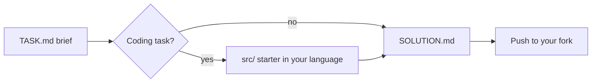

<p align="center">
  <a href="https://redduck.io/?utm_source=github&amp;utm_medium=readme&amp;utm_campaign=redduck-academy-engineering-template">
    <picture>
      <source media="(prefers-color-scheme: dark)" srcset=".github/assets/redduck-logo-dark.svg">
      
    </picture>
  </a>
</p>

<h1 align="center">RedDuck Academy — Engineering Principles Template</h1>

<p align="center">
  <b>Five judgement exercises in the language of your choice — nothing to build, everything to reason about.</b>
</p>

---

An engineering-principles template by [RedDuck](https://redduck.io/?utm_source=github&utm_medium=readme&utm_campaign=redduck-academy-engineering-template). Fork it, work through the tasks in the language of your choice, push your work. The tasks are about spotting a flaw, naming it, and arguing the fix; the work is reviewed by reading the files you push, so nothing needs to build or run.

## Built with

| Area | Technology |
| --- | --- |
| Languages | TypeScript, Python, Java, C# — pick one and use it throughout |
| Task format | `TASK.md` brief + `SOLUTION.md` you fill in |
| Coding tasks | A starter file per language in `src/`; task 05 also ships `tests/` |
| Tooling | None — no build step, no dependencies, no runner |

## How it works



Each task is a folder with a `TASK.md` brief and a `SOLUTION.md` you fill in. Coding tasks also have a `src/` folder with a starter file in each supported language. Complete the starter for your language and leave the other languages as they are.

```
.
└── 01-common-sense-check/
    ├── TASK.md              # brief — read this first
    ├── SOLUTION.md          # your write-up
    └── src/                 # starter per language
        ├── checkout.ts
        ├── checkout.py
        ├── Checkout.java
        └── Checkout.cs
```

## Tasks

| # | Task | What you do | Code |
| --- | --- | --- | --- |
| 01 | [`01-common-sense-check`](01-common-sense-check/) | Find and fix a common-sense flaw | `src/` |
| 02 | [`02-recognize-bypass`](02-recognize-bypass/) | Recognize when a bypass is available | write-up only |
| 03 | [`03-core-periphery`](03-core-periphery/) | Apply core and periphery | `src/` |
| 04 | [`04-content-derived-factory`](04-content-derived-factory/) | Build a content-derived factory | `src/` |
| 05 | [`05-adversarial`](05-adversarial/) | Break the system as an adversary | `src/` + `tests/` |

## Getting started

No install, no build. Clone your fork, open `01-common-sense-check/TASK.md`, and start reading.

## Workflow per task

1. Read the task's `TASK.md`.
2. For a coding task, complete the starter file for your language in `src/`.
3. Write your answer in `SOLUTION.md`.
4. Commit and push to your fork.

## License

[MIT](LICENSE)
